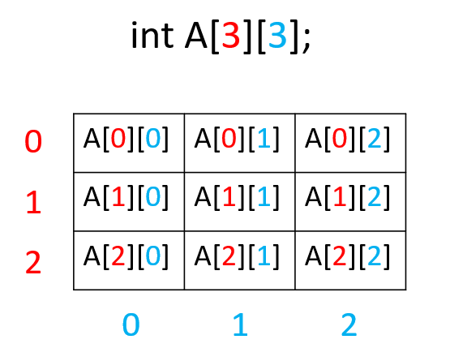
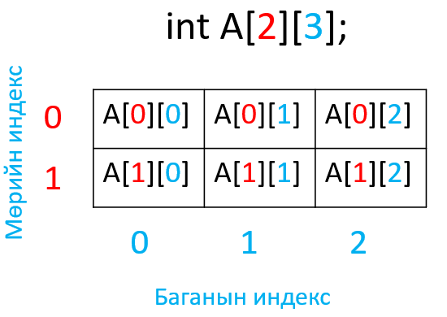

# Хоёр хэмжээст хүснэгт

## 2 хэмжээст тэмдэгтэн хүснэгт
Дараах жишээг зурагт үзүүлэв.
```c
int main(){
  int A[3][3] = {{0,1,2},{3,4,5},{6,7,8}};
  for(int i=0;i<3;i++){ //Mur
    for(int j=0;j<3;j++){ //Bagana
      cout<<A[i][j]<<" ";
    }
    cout<<'\n';
  }
  return 0;
}
```
<br>

```c
int main(){
  int A[2][3];
  //Garaas utga unshih
  for(int i=0;i<2;i++){ //Mur
    for(int j=0;j<3;j++){ //Bagana
      cin>>A[i][j];
    }
  }
  //2D husnegtiig hevleh
  for(int i=0;i<2;i++){ //Mur
    for(int j=0;j<3;j++){ //Bagana
      cout<<A[i][j]<<" ";
    }
    cout<<'\n';
  }
  return 0;
}
```
<br>

## Дасгал ажлууд ##

<br>1. 3x4 хэмжээтэй 2 хэмжээст хүснэгт зарлаж. Бүх элементэд 10 утга оноож хэвлэ.

<br>2. 3x4 хэмжээтэй 2 хэмжээст хүснэгт зарлаж. Элементүүдийг гараас уншиж хүснэгтийг хэвлэ.

<br>3. 4x4 хэмжээтэй 2 хэмжээст хүснэгт зарлаж. Тэгш индекстэй мөрүүдийн нийт элементүүдийн нийлбэрийг олж хэвлэ.

</pr> 12 12 12 12
</pr> 22 22 22 22
</pr> 33 33 33 33
</pr> 55 55 55 55

180

<br>4. 4x4 хэмжээтэй 2 хэмжээст хүснэгт зарлаж элементүүдийг гараас авна. Зүүн дээд булангаас баруун доод булан хүртэлх диагональ дээрх элементүүдийн нийлбэрийг хэвлэ.

</pr> 12 12 12 12
</pr> 22 22 22 22
</pr> 33 33 33 33
</pr> 55 55 55 55

122

<br>5. 4x4 хэмжээтэй 2 хэмжээст хүснэгт зарлаж элементүүдийг гараас авна. Зүүн дээд булангаас баруун доод булан хүртэлх диагональ дээрх элементүүдийн нийлбэрийг хэвлэ.

</pr> 12 12 12 12
</pr> 22 22 22 22
</pr> 33 33 33 33
</pr> 55 55 55 55

122

<br>6. 4x4 хэмжээтэй 2 хэмжээст хүснэгт зарлаж элементүүдийг гараас авна. Тухайн мөр дэх тэгш тоонуудыг хэвлэ.

</pr> 12 11 2  5
</pr> 22 22 22 22
</pr> 33 33 33 33
</pr> 55 55 50 54

</pr>

</pr>12 2
</pr>22 22 22 22
</pr>
</pr>50 54