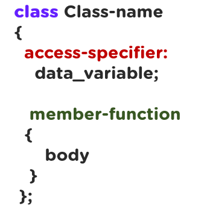

# string (Тэмдэгтийн цуваа)

- string бол c++ хэлний стандарт классуудын нэг юм.
 
 - Оролтын функцүүд 
| Function|  |
|------|-------| 
| getline()|   |
| push_back()| |
| pop_back()|  |

 - Хэмжээтэй холбоотой функцүүд 
| Функцүүд ||
|-----|-----|
| size()|  |
|length()| |
|empty()| |
|clear()| |
|erase()| |
|substr()| |
|find()| |
|find_last_of()| |
|find_first_of()| |
|compare()| |

 - Эхний ба төгсгөлийн элеметрүү хандах
| Функцүүд ||
|-----|-----|
|front()|  |
|back()|   |

 - 2 string хоорондын үйлдлүүд 
| Функцүүд ||
|-----|-----|
|s1=s2| copy to s1  |
|s1+s2|  |
|s1.swap(s2)|   |


*Класс зарлах дүрэм*
<br>

``` c++
int main()
{
  Rectangle M;
  cin >> M.height;
  cin >> M.width;
  cout << M.calculateArea()<<endl;
  cout << M.calculatePerimeter()<<endl;
  return 0;
}
```

## Дасгал ажлууд ##

<br>1. Гараас тэмдэгтийн цуваа өгөгдөнө. Тэмдэгтийн тоог хэвлэ.
<br/> hadgalagdah
<br/> 11

<br>2. Гараас тэмдэгтийн цуваа өгөгдөнө. Түүнийг эргүүлэн хэвлэ.
<br/> hadgalagdah
<br/> hadgalagdah

<br>3. Гараас тэмдэгтийн цуваа өгөгдөнө. Түүний тэмдэгтүүдийг урвуугаар хэвлэ.
<br/> Simplylearn
<br/> nraelylpmiS

<br>4. Гараас тэмдэгтийн цуваа өгөгдөнө. Түүний тэмдэгтүүдийг урвуугаар хэвлэ.
<br/> Simplylearn
<br/> nraelylpmiS

<br>5. Гараас тэмдэгтийн цуваа өгөгдөнө. Палиндром бол Yes үгүй бол No гэж хэвлэ.
<br/> Simplylearn
<br/> No

<br/> hadgalagdah
<br/> Yes

<br>6. https://atcoder.jp/contests/abc060/tasks/abc060_a 
  *back(), front() ашиглаж бодно*

<br>7. https://accepted.mn/it/problems/309/
  *getline(cin,s) ашиглаж бодно*

<br>8. https://www.spoj.com/problems/OLAI1/ (Олимпиадын бодлого)

<br>9. https://kenkoooo.com/atcoder/#/contest/show/3cef52ea-e433-49c0-b319-c523c46886b4 